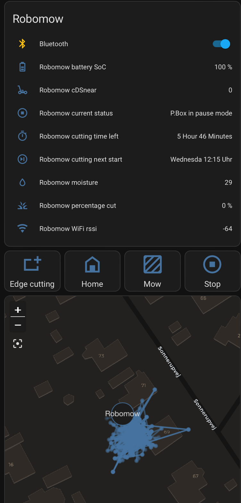

# Robomow-ESP32
## ESP32 based bluetooth Robomow controller

Based on https://www.skyynet.de/mowgli_connect.php

This is a modification of the original binary file to English.  
Since there is only a binary file, I have made a ugly script that simply replaces all (or most) German text with English translations, and recalculates the checksums.


## Instructions:

1. Download https://www.skyynet.de/ftp/mspitzel_v105.zip
2. Unzip
3. Modify WLAN_local_SSID and WLAN_local_password to match your WIFI's SSID and password in src/mspitzelAPconnect.ino
4. Modify http_username and http_password to what you want
5. Load it in the Arduino IDE with the following
<details>
  <summary>settings</summary>
    * Board: LOLIN D32 PRO</br>
    * Upload Speed: 921600</br>
    * Flash Frequency: 80MHz</br>
    * Partition Scheme: Minimal SPIFFS (Large APPS with OTA)</br>
    * Core Debug Level: None</br>
    * PSRAM: Enabled</br>
    * Port : where your LOLIN is connected</br>
</details>

   or compile and install with [platform.io](https://docs.platformio.org/en/stable/core/installation/index.html) using "pio run --target upload"

6. When the ESP32 connects to you WiFi, go to http://<IP>:8080
7. Upload my modified binary file: mspitzel.ino.d32_pro_en.bin
8. Wait! it takes about 2 full minutes before it returns "OK"
9. If you get "Fehler" just try again.
10. Go to http://<IP>
11. Go to the Configuration tab and input your robots bluetooth name under "SSID" and the [mainboard serial number](MBSERIAL.md) under "Mainboard SN"
12. Now it should connect to your robot and show all kinds of data.

## To add it to Home Assisntant:


Copy robomow.yaml to config/packages/robomow.yaml  
<sub>make dir config/packages if non existent</sub>

Add this to config/configuration.yaml  
```
homeassistant:  
  packages: !include_dir_named packages
```

## Hardware:
You need a ESP32 with PSRAM, so called WROVER module.  
I bought a LOLIN as mentioned from [Aliexpress](https://www.aliexpress.com/item/32883116057.html) but I guess any with PSRAM would work.

I didn't wanted GPS to begin with, but since it works so well and the GPS module is so cheap I also got [this](https://www.aliexpress.com/item/914261817.html)

I guess it would be better with a module that works with all 5 possitioning systems: GPS (US), QZSS (Japan), BEIDOU (China), GALILEO (EU), and GLONASS (Russia), but I wasn't sure the protocol is compatible (all though the [NMEA 0183](https://en.wikipedia.org/wiki/NMEA_0183) protocol seems to be universal).
