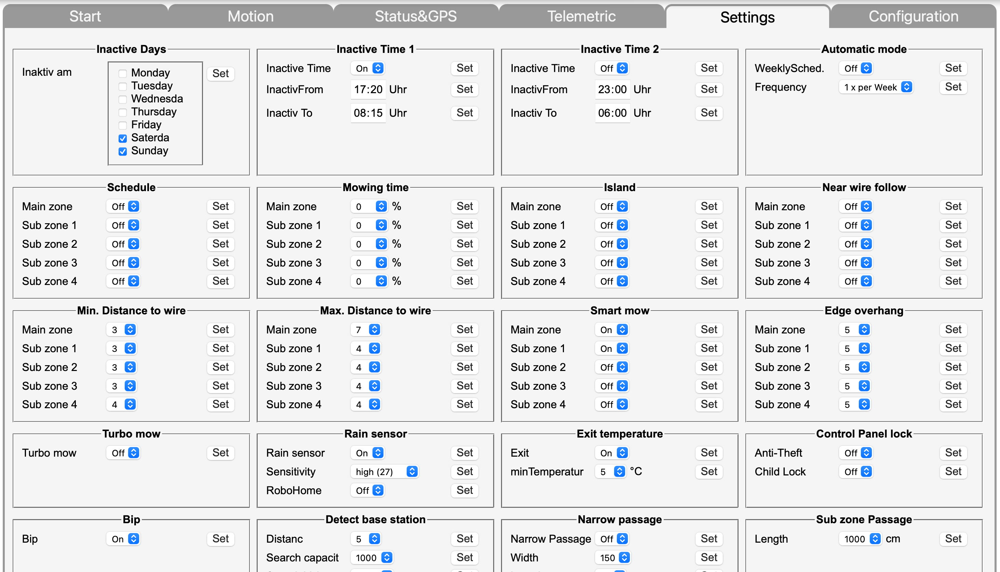

# Robomow-ESP32
## ESP32 based bluetooth Robomow controller

Based on https://www.skyynet.de/mowgli_connect.php

This is a modification of the original binary file to English.
Since there is only a binary file, I have made a ugly script that simply replaces all (or most) German text with English translations, and recalculates the checksums.

## Instructions:

1. Download https://www.skyynet.de/ftp/mspitzel_v105.zip
2. Unzip and load it in the Arduino IDE
3. Modify def_ssid and def_pass to match your WIFI's SSID and password
4. Compile and install on the ESP32.
5. When the ESP32 connects to you WiFi, go http://<IP>:8080
6. Upload my modified binary file
7. Wait! it takes about 2 full minutes before it returns "OK"
8. If you get "Fehler" just try again.
9. Go to http://<IP>
10. Go to the Configuration tab and input your robots bluetooth name under "SSID" and the mainboard serial number under "Mainboard SN"
12. Now it should connect to your robot and show all kinds of data.

## To add it to Home Assisntant:

[[ images/homeassistant.png | height = 25% ]]

Copy robomow.yaml to config/robomow.yaml

Add this to config/configuration.yaml
homeassistant:
  customize: !include robomow.yaml
